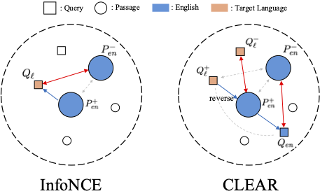

<div align="center">

# CLEAR: Cross-Lingual Enhancement in Retrieval via Reverse-training

<h4>
  Seungyoon Lee<sup>1</sup>
  ·
  Minhyuk Kim<sup>1</sup>
  ·
  Seongtae Hong<sup>1</sup>
  ·
  Youngjoon Jang<sup>1</sup>
  ·
  Dongsuk Oh<sup>2</sup>
  ·
  Heuiseok Lim<sup>1*</sup>
</h4>

<p><sup>1</sup>Korea University &nbsp;&nbsp;<sup>2</sup>Kyungpook National University
<br><sup>*</sup>Corresponding author &nbsp;&nbsp;

[](https://arxiv.org/abs/2604.05821)
[![Conference](https://img.shields.io/badge/ACL_2026-grey.svg?style=flat&logo=data:image/svg+xml;base64,PD94bWwgdmVyc2lvbj0iMS4wIiBlbmNvZGluZz0iVVRGLTgiIHN0YW5kYWxvbmU9Im5vIj8+CjwhLS0gQ3JlYXRlZCB3aXRoIElua3NjYXBlIChodHRwOi8vd3d3Lmlua3NjYXBlLm9yZy8pIC0tPgo8c3ZnCiAgIHhtbG5zOnN2Zz0iaHR0cDovL3d3dy53My5vcmcvMjAwMC9zdmciCiAgIHhtbG5zPSJodHRwOi8vd3d3LnczLm9yZy8yMDAwL3N2ZyIKICAgdmVyc2lvbj0iMS4wIgogICB3aWR0aD0iNjgiCiAgIGhlaWdodD0iNjgiCiAgIGlkPSJzdmcyIj4KICA8ZGVmcwogICAgIGlkPSJkZWZzNCIgLz4KICA8cGF0aAogICAgIGQ9Ik0gNDEuOTc3NTUzLC0yLjg0MjE3MDllLTAxNCBDIDQxLjk3NzU1MywxLjc2MTc4IDQxLjk3NzU1MywxLjQ0MjExIDQxLjk3NzU1MywzLjAxNTggTCA3LjQ4NjkwNTQsMy4wMTU4IEwgMCwzLjAxNTggTCAwLDEwLjUwMDc5IEwgMCwzOC40Nzg2NyBMIDAsNDYgTCA3LjQ4NjkwNTQsNDYgTCA0OS41MDA4MDIsNDYgTCA1Ni45ODc3MDgsNDYgTCA2OCw0NiBMIDY4LDMwLjk5MzY4IEwgNTYuOTg3NzA4LDMwLjk5MzY4IEwgNTYuOTg3NzA4LDEwLjUwMDc5IEwgNTYuOTg3NzA4LDMuMDE1OCBDIDU2Ljk4NzcwOCwxLjQ0MjExIDU2Ljk4NzcwOCwxLjc2MTc4IDU2Ljk4NzcwOCwtMi44NDIxNzA5ZS0wMTQgTCA0MS45Nzc1NTMsLTIuODQyMTcwOWUtMDE0IHogTSAxNS4wMTAxNTUsMTcuOTg1NzggTCA0MS45Nzc1NTMsMTcuOTg1NzggTCA0MS45Nzc1NTMsMzAuOTkzNjggTCAxNS4wMTAxNTUsMzAuOTkzNjggTCAxNS4wMTAxNTUsMTcuOTg1NzggeiAiCiAgICAgc3R5bGU9ImZpbGw6I2VkMWMyNDtmaWxsLW9wYWNpdHk6MTtmaWxsLXJ1bGU6ZXZlbm9kZDtzdHJva2U6bm9uZTtzdHJva2Utd2lkdGg6MTIuODk1NDExNDk7c3Ryb2tlLWxpbmVjYXA6YnV0dDtzdHJva2UtbGluZWpvaW46bWl0ZXI7c3Ryb2tlLW1pdGVybGltaXQ6NDtzdHJva2UtZGFzaGFycmF5Om5vbmU7c3Ryb2tlLWRhc2hvZmZzZXQ6MDtzdHJva2Utb3BhY2l0eToxIgogICAgIHRyYW5zZm9ybT0idHJhbnNsYXRlKDAsIDExKSIKICAgICBpZD0icmVjdDIxNzgiIC8+Cjwvc3ZnPgo=)](https://aclanthology.org/)


</div>

---

*This repository contains the code for our paper **CLEAR**, a novel training loss function for Cross-lingual Information Retrieval (CLIR), designed to formulate robust cross-lingual alignment via English representation.*

<div align="center">



</div>

## Installation

### Requirements

- Python 3.8+
- CUDA-compatible GPU (recommended)

### Setup

1. Clone the repository:
```bash
git clone https://github.com/dltmddbs100/CLEAR.git
cd CLEAR
```

2. Install dependencies:
```bash
pip install -r requirements.txt
```

This will install:
- PyTorch 2.6.0
- Transformers 4.45.0
- Sentence-Transformers 3.4.1
- Datasets 2.21.0
- Accelerate 0.34.2
- WandB (for logging)
- Local MTEB package (from `./mteb`)

### Optional: DeepSpeed Support

For distributed training with DeepSpeed:
```bash
pip install deepspeed==0.14.4
```

## Dataset Format
We support an example training dataset at [here](/dataset/).
Training data should be the following format:

| Column | Description |
|--------|-------------|
| `anchor` | Source language query |
| `positive` | Positive document |
| `negative_1` ... `negative_n` | Hard negative documents |
| `cross_anchor` | Target language query (translation of anchor) |
| `neg_query_1` ... `neg_query_n` | Hard negative queries in target language |

Example:
```json
{
  "anchor": "What is machine learning?",
  "positive": "Machine learning is a subset of artificial intelligence...",
  "negative_1": "Deep learning requires large datasets...",
  "cross_anchor": "Was ist maschinelles Lernen?",
  "neg_query_1": "Wie funktioniert künstliche Intelligenz?"
}
```

You can use HuggingFace datasets by setting `--use_hf_dataset`.

## Training

```bash
export OMP_NUM_THREADS=32

CUDA_VISIBLE_DEVICES=0,1,2,3 torchrun --nproc_per_node 4 --master_port 25055 script/train.py \
    --model_name_or_path BAAI/bge-m3 \
    --dataset_path dataset/train_example_de \
    --output_dir ckpt/bge-m3-de-CLEAR \
    --loss_name CachedCLEARLoss \
    --alpha 0.4 \
    --beta 0.2 \
    --kl_div \
    --use_hf_dataset \
    --do_train \
    --per_device_train_batch_size 64 \
    --mini_batch_size 32 \
    --learning_rate 5e-5 \
    --max_steps 50 \
    --warmup_ratio 0.05 \
    --lr_scheduler_type cosine \
    --max_seq_length 512 \
    --bf16 \
    --report_to wandb \
    --save_strategy steps \
    --save_steps 50 \
    --save_total_limit 1
```

## Evaluation

CLEAR uses a customized version of [MTEB](https://github.com/embeddings-benchmark/mteb) for evaluation on cross-lingual retrieval benchmarks.

### Evaluate on XQuAD

```bash
# Monolingual (English)
CUDA_VISIBLE_DEVICES=0 mteb run -m ckpt/your-model \
    --tasks XQuADRetrieval \
    --languages eng-Latn \
    --output_folder eval_results/xquad/en-en \
    --batch_size 32

# Cross-lingual (German query → English documents)
CUDA_VISIBLE_DEVICES=0 mteb run -m ckpt/your-model \
    --tasks XQuADCrossRetrieval_EN_LANG \
    --languages deu-Latn \
    --output_folder eval_results/xquad/en-de \
    --batch_size 32

# Cross-lingual (English query → German documents)
CUDA_VISIBLE_DEVICES=0 mteb run -m ckpt/your-model \
    --tasks XQuADCrossRetrieval_LANG_EN \
    --languages deu-Latn \
    --output_folder eval_results/xquad/de-en \
    --batch_size 32
```

### Evaluate on Belebele

```bash
# English
CUDA_VISIBLE_DEVICES=0 mteb run -m ckpt/your-model \
    --tasks BelebeleRetrieval \
    --languages eng-Latn-eng-Latn \
    --output_folder eval_results/belebele/en \
    --batch_size 32

# Other languages
CUDA_VISIBLE_DEVICES=0 mteb run -m ckpt/your-model \
    --tasks BelebeleRetrieval \
    --languages deu-Latn \
    --output_folder eval_results/belebele/de \
    --batch_size 32
```


### Batch Evaluation

Use the provided scripts to evaluate across multiple languages:

```bash
# Evaluate trained model
bash script/eval_ours_bele_xquad.sh

# Evaluate baseline (no training)
bash script/eval_notrain_bele_xquad.sh
```

## Project Structure

```
CLEAR/
├── train.py              # Main training script
├── loss.py               # CLEAR loss implementations
├── collator.py           # Data collator for cross-lingual data
├── requirements.txt      # Python dependencies
├── dataset/              # Training datasets
├── ckpt/                 # Model checkpoints
├── eval_results/         # Evaluation outputs
├── logs/                 # Training logs
├── mteb/                 # Custom MTEB package
├── script/               # Training and evaluation scripts
└── asset/                # Assets and figures
```

## Citation

If you find this work useful, please cite:
```bibtex
@article{lee2026clear,
  title={CLEAR: Cross-Lingual Enhancement in Alignment via Reverse-training},
  author={Lee, Seungyoon and Kim, Minhyuk and Hong, Seongtae and Jang, Youngjoon and Oh, Dongsuk and Lim, Heuiseok},
  journal={arXiv preprint arXiv:2604.05821},
  year={2026}
}
```


## License

This project is licensed under the MIT License.

## Acknowledgements

- [Sentence-Transformers](https://www.sbert.net/)
- [MTEB](https://github.com/embeddings-benchmark/mteb)
